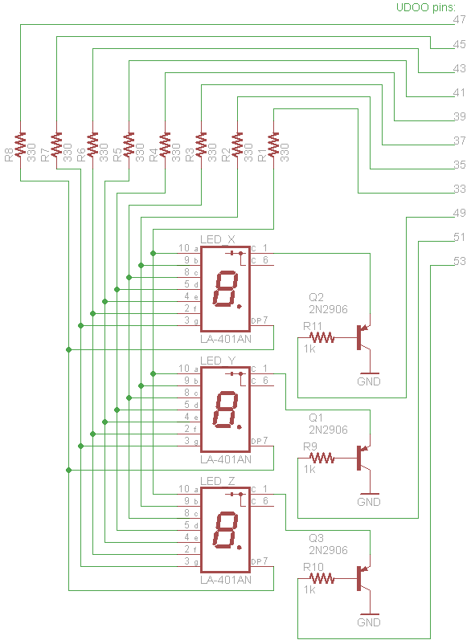

Info
----
A driver for a 3 digit 7 segment bubble LED display from the 70s.
Python code is written to control the GPIO pins on the UDOO single board computer.

Hookup
------
LED segments are connected to the odd pins 33 through 47, with 330ohm resistors.

Pins 49, 51, 53 go to PNP transistors (with 1kohm resistors) connected to the
three common cathode pins.

The below is representative; The mapping between UDOO pins to segment letters (a,b,c etc...) is correct. The mapping between the bubble LED's pin numbers and segment letters is not.

